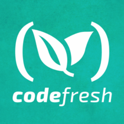

| pipeline name   | Last build status  |
|---|---|
|Build-first-image   |   |
|Build-codefresh-yml   |   |
###### Full credit for the application [react-starter-kit](https://github.com/kriasoft/react-starter-kit)

## Setup your first service using [Codefresh](https://codefresh.io/).

### Step-by-step tutorial:
#### 1. Fork this repo.

#### 2. Login into codefresh using your github account.

#### 3. Add your first service and build it.

#### 4. Wait until the build is done.

#### 5. Open images and click 'lunch'.

#### 5. VOILÀ   

### Start using codefresh.yml
#### Using codefresh.yml you can customize your pipeline
Now when your first service is setup and your first pipeline produced an image, lets move forward and push the image to Dockerhub registry.
We at Codefresh already build for you the basic `codefresh.yml` template, use it.
- Click on your service `react-starter-kit`.
- Switch to `Use YML build`.
- Under Environment variables fill your Dockerhub credentials to be.
  - `DOCKER_USER_NANE` your Dockerhub user name
  - `DOCKER_PASSWORD` your Dockerhub password
- Dont forget to encrypt them!
- Save your updated pipeline
- Build and launch
