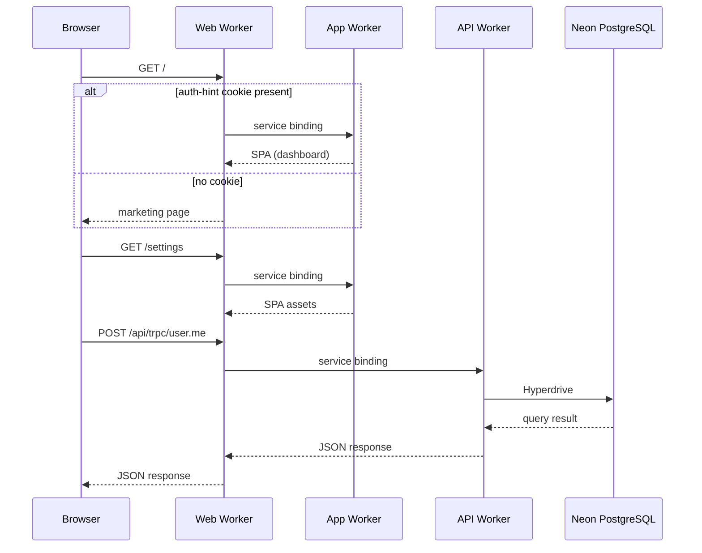

# Architecture Overview

React Starter Kit runs on three Cloudflare Workers connected by [service bindings](https://developers.cloudflare.com/workers/runtime-apis/bindings/service-bindings/). A single domain receives all traffic – the **web** worker routes each request to the right destination without any cross-worker public URLs.

## Request Flow



## Workers

| Worker  | Workspace  | Purpose                                               | Has `nodejs_compat` |
| ------- | ---------- | ----------------------------------------------------- | :-----------------: |
| **web** | `apps/web` | Edge router – receives all traffic, routes to app/api |         No          |
| **app** | `apps/app` | SPA static assets (React, TanStack Router)            |         No          |
| **api** | `apps/api` | Hono server – tRPC, Better Auth, webhooks             |         Yes         |

### Web Worker

The web worker is the only worker with a public route (`example.com/*`). It decides where each request goes:

* `/api/*` – forwarded to the API worker
* `/login`, `/signup`, `/settings`, `/analytics`, `/reports`, `/_app/*` – forwarded to the app worker
* `/` – routed by [auth hint cookie](#auth-hint-cookie) (app if signed in, marketing site if not)
* Everything else – served from the web worker's own static assets (marketing pages)

```ts
// apps/web/worker.ts (simplified)
app.all("/api/*", (c) => c.env.API_SERVICE.fetch(c.req.raw));
app.all("/login*", (c) => c.env.APP_SERVICE.fetch(c.req.raw));

app.on(["GET", "HEAD"], "/", async (c) => {
  const hasAuthHint =
    getCookie(c, "__Host-auth") === "1" || getCookie(c, "auth") === "1";
  const upstream = await (hasAuthHint ? c.env.APP_SERVICE : c.env.ASSETS).fetch(
    c.req.raw,
  );
  // ...
});
```

### App Worker

A static asset worker with `not_found_handling: "single-page-application"` – any path that doesn't match a file returns `index.html`, enabling client-side routing via TanStack Router.

The app worker has no custom worker script. It is accessed only through service bindings from the web worker.

### API Worker

Runs the Hono HTTP server with the following middleware chain:

```ts
// apps/api/worker.ts (simplified)
worker.onError(errorHandler);
worker.notFound(notFoundHandler);
worker.use(secureHeaders());
worker.use(requestId({ generator: requestIdGenerator }));
worker.use(logger());

// Initialize shared context
worker.use(async (c, next) => {
  c.set("db", createDb(c.env.HYPERDRIVE_CACHED));
  c.set("dbDirect", createDb(c.env.HYPERDRIVE_DIRECT));
  c.set("auth", createAuth(db, c.env));
  await next();
});

worker.route("/", app); // Mounts tRPC + auth + health routes
```

Endpoints mounted in the core app:

| Path          | Handler                                                |
| ------------- | ------------------------------------------------------ |
| `/api/auth/*` | Better Auth (login, signup, sessions, OAuth callbacks) |
| `/api/trpc/*` | tRPC procedures (batching enabled)                     |
| `/health`     | Health check                                           |

## Service Bindings

Service bindings let workers call each other directly over Cloudflare's internal network – no HTTP round-trip through the public internet.

```jsonc
// apps/web/wrangler.jsonc
"services": [
  { "binding": "APP_SERVICE", "service": "example-app" },
  { "binding": "API_SERVICE", "service": "example-api" }
]
```

::: warning
Service bindings are **non-inheritable** in Wrangler – they must be declared in every environment block. Forgetting this causes staging/preview workers to bind to production services.
:::

Naming convention: `<project>-<worker>-<env>` (e.g. `example-api-staging`). See [Edge > Service Bindings](./edge#service-bindings) for the full per-environment config.

## Database Connection

The API worker connects to [Neon PostgreSQL](https://neon.tech) via [Cloudflare Hyperdrive](https://developers.cloudflare.com/hyperdrive/) – a connection pool that sits between Workers and your database.

Two bindings are available:

| Binding             | Cache | Use case                              |
| ------------------- | ----- | ------------------------------------- |
| `HYPERDRIVE_CACHED` | 60 s  | Default reads – most queries go here  |
| `HYPERDRIVE_DIRECT` | None  | Writes and reads that need fresh data |

Both bindings are initialized in the API worker middleware and available on every request context as `db` and `dbDirect`. See [Database](/database/) for schema and query patterns.

## Auth Hint Cookie

The `/` route serves two different experiences – a marketing page for visitors and the app dashboard for signed-in users. The web worker needs a fast signal to choose without owning auth logic.

**How it works:** Better Auth sets a lightweight `__Host-auth=1` cookie on sign-in and clears it on sign-out. The web worker checks only for cookie *presence* – it never validates sessions. If the cookie exists, the request goes to the app worker; otherwise it serves the marketing page.

This cookie is a **routing hint only**, not a security boundary. A false positive (stale cookie) results in one extra redirect to `/login` – the app worker validates the real session.

::: info
In local development the cookie is named `auth` (HTTP), since browsers reject the `__Host-` prefix without HTTPS.
:::

See [ADR-001](/adr/001-auth-hint-cookie) for the full decision record and [Sessions & Protected Routes](/auth/sessions) for the auth flow.

## Environments

| Environment | Workers         | Domain                | Database       | Deploy command                  |
| ----------- | --------------- | --------------------- | -------------- | ------------------------------- |
| Development | `wrangler dev`  | `localhost:5173`      | Dev branch     | `bun dev`                       |
| Preview     | `*-preview`     | `preview.example.com` | Preview branch | `wrangler deploy --env preview` |
| Staging     | `*-staging`     | `staging.example.com` | Staging branch | `wrangler deploy --env staging` |
| Production  | `*` (no suffix) | `example.com`         | Main branch    | `wrangler deploy`               |

Each environment has its own Hyperdrive bindings, service binding targets, and `APP_ORIGIN` / `ALLOWED_ORIGINS` variables. See [Edge > Service Bindings](./edge#service-bindings) for the full wrangler config.

## Build Order

The workspaces must build in dependency order:

```
email → web → api → app
```

Email templates are compiled first because the API server imports them. The `bun build` command handles this automatically.

## Key Invariants

* The **API worker is the sole authority** for authentication and data access – the web worker never validates sessions or queries the database.
* Only the **web worker** has public routes. App and API workers are accessed exclusively through service bindings.
* **Service bindings are non-inheritable** – every Wrangler environment must declare its own bindings.
* The auth hint cookie is a **routing optimization**, not a security mechanism.
* The API worker is the only worker with `nodejs_compat` enabled.
