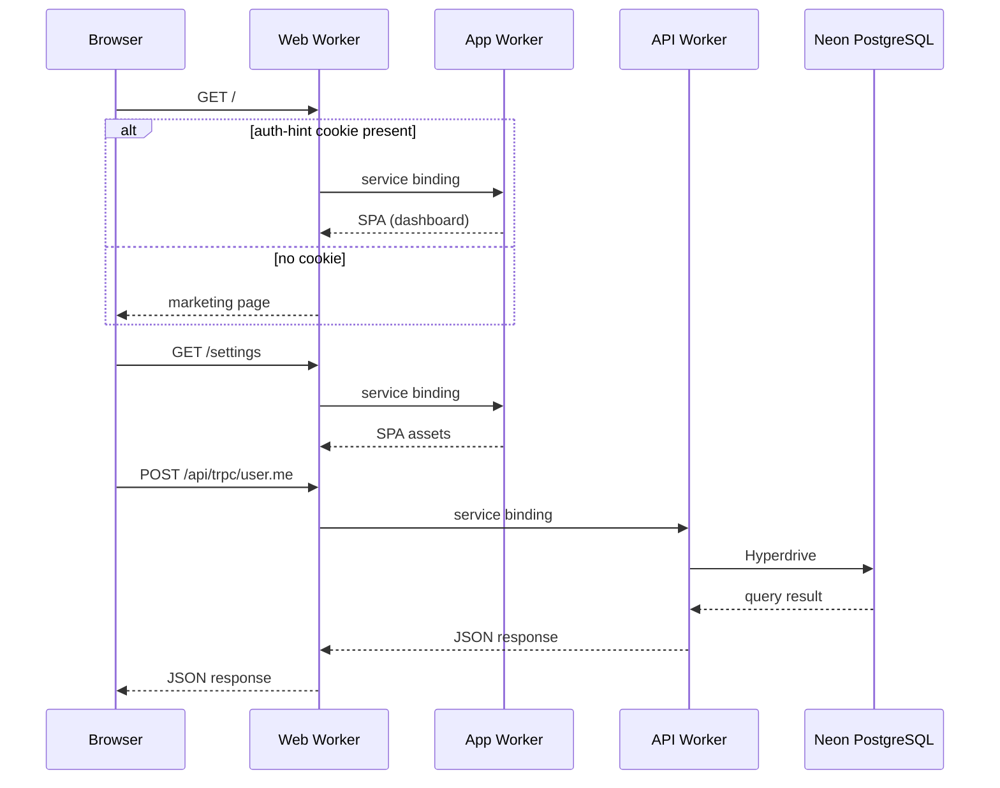

# Architecture Overview

React Starter Kit runs on three Cloudflare Workers connected by [service bindings](https://developers.cloudflare.com/workers/runtime-apis/bindings/service-bindings/). A single domain receives all traffic – the **web** worker routes each request to the right destination without any cross-worker public URLs.

## Request Flow



## Workers

| Worker | Workspace | Purpose | Has `nodejs_compat` |
| --- | --- | --- | :-: |
| **web** | `apps/web` | Marketing site + edge router – receives all traffic, routes to app/api | No |
| **app** | `apps/app` | SPA static assets (React, TanStack Router) | No |
| **api** | `apps/api` | Hono server – tRPC, Better Auth, webhooks | Yes |

### Web Worker

The web worker is the only worker attached to a public hostname (`example.com`). It decides where each request goes:

- `/api/*` – forwarded to the API worker
- The SPA paths listed in `APP_PATHS` (`/dashboard`, `/users`, `/settings`, `/analytics`, `/reports`, `/login`, `/signup`) and `/_app/*` – forwarded to the app worker
- `/` – routed by [auth hint cookie](#auth-hint-cookie) (app if signed in, marketing site if not)
- Everything else – served from the web worker's own static assets (marketing pages)

```ts
// apps/web/worker.ts (simplified)
app.all("/api/*", (c) => c.env.API_SERVICE.fetch(c.req.raw));

// Exact path plus descendants — never a bare prefix, which would send
// /users-guide to the SPA fallback. `apps/app/lib/edge-routing.test.ts`
// checks this list against the route files.
for (const path of APP_PATHS) {
  app.all(`/${path}`, (c) => c.env.APP_SERVICE.fetch(c.req.raw));
  app.all(`/${path}/*`, (c) => c.env.APP_SERVICE.fetch(c.req.raw));
}

app.on(["GET", "HEAD"], "/", async (c) => {
  const hasAuthHint =
    getCookie(c, "__Host-auth") === "1" || getCookie(c, "auth") === "1";
  const upstream = await (hasAuthHint ? c.env.APP_SERVICE : c.env.ASSETS).fetch(
    c.req.raw,
  );
  // ...
});
```

### App Worker

A static asset worker with `not_found_handling: "single-page-application"` – any path that doesn't match a file returns `index.html`, enabling client-side routing via TanStack Router.

The app worker has no custom worker script. It is accessed only through service bindings from the web worker.

### API Worker

Runs the Hono HTTP server with the following middleware chain:

```ts
// apps/api/worker.ts (simplified)
worker.onError(errorHandler);
worker.notFound(notFoundHandler);
worker.use(secureHeaders());
worker.use(requestId({ generator: requestIdGenerator }));
worker.use(logger());

// Initialize shared context
worker.use(async (c, next) => {
  const db = createDb(c.env.HYPERDRIVE_UNCACHED);
  const dbCached = createDb(c.env.HYPERDRIVE_CACHED);
  c.set("db", db);
  c.set("dbCached", dbCached);
  c.set("auth", createAuth(db, c.env)); // Sessions must not be stale
  await next();
});

worker.route("/", app); // Mounts tRPC + auth + health routes
```

Primary endpoints:

| Path          | Handler                                                |
| ------------- | ------------------------------------------------------ |
| `/api/auth/*` | Better Auth (login, signup, sessions, OAuth callbacks) |
| `/api/trpc/*` | tRPC procedures (batching enabled)                     |
| `/api`        | API info (name, version, endpoint list)                |
| `/health`     | Health check                                           |

## Service Bindings

Service bindings let workers call each other directly over Cloudflare's internal network – no HTTP round-trip through the public internet.

```jsonc
// apps/web/wrangler.jsonc
"services": [
  { "binding": "APP_SERVICE", "service": "example-app" },
  { "binding": "API_SERVICE", "service": "example-api" }
]
```

::: warning

Service bindings are **non-inheritable** in Wrangler – they must be declared in every environment block. Forgetting this causes staging workers to bind to production services.

:::

Naming convention: `<project>-<worker>-<env>` (e.g. `example-api-staging`). See [Edge > Service Bindings](./edge#service-bindings) for the full per-environment config.

## Database Connection

The API worker connects to [Neon PostgreSQL](https://neon.tech) via [Cloudflare Hyperdrive](https://developers.cloudflare.com/hyperdrive/) – a connection pool that sits between Workers and your database.

Two bindings are available:

| Binding               | Caching  | Use case                             |
| --------------------- | -------- | ------------------------------------ |
| `HYPERDRIVE_CACHED`   | Enabled  | Opt-in reads that tolerate staleness |
| `HYPERDRIVE_UNCACHED` | Disabled | Default for writes and fresh reads   |

Both bindings are initialized in the API worker middleware and available on every request context as `db` (uncached) and `dbCached` (cached). See [Database](/database/) for schema and query patterns.

## Auth Hint Cookie

The `/` route serves two different experiences – a marketing page for visitors and the app dashboard for signed-in users. The web worker needs a fast signal to choose without owning auth logic.

**How it works:** Better Auth sets a lightweight `__Host-auth=1` cookie on sign-in and clears it on sign-out. The web worker checks only that its value is `1` – it never validates sessions. A match routes the request to the app worker; otherwise the worker serves the marketing page.

This cookie is a **routing hint only**, not a security boundary. A false positive (stale cookie) results in one extra redirect to `/login` – the app worker validates the real session.

::: info

In local development the cookie is named `auth` (HTTP), since browsers reject the `__Host-` prefix without HTTPS.

:::

See [ADR-001](/adr/001-auth-hint-cookie) for the full decision record and [Sessions & Protected Routes](/auth/sessions) for the auth flow.

## Environments

| Environment | Runtime | Domain | Database | Command |
| --- | --- | --- | --- | --- |
| Development | Vite/Astro/Bun | `localhost:5173` | Dev branch | `bun dev` |
| Staging | `*-staging` | `staging.example.com` | Main branch | `wrangler deploy --env staging` |
| Production | `*` (no suffix) | `example.com` | Main branch | `wrangler deploy --env=""` |

Staging and production each have their own deployed Hyperdrive and service bindings. Local development maps each Hyperdrive binding to its `CLOUDFLARE_HYPERDRIVE_LOCAL_CONNECTION_STRING_*` value, which connects straight to Postgres – so neither pooling nor query caching is active locally, and `DATABASE_URL` is not involved at all: that one belongs to the Drizzle tooling in `db/`. Vite proxies API requests directly to the Bun server.

## Build Order

The API server imports the compiled email package, so that workspace must build first. The web and app builds are independent. `bun run build` lets Bun order the email → API dependency while running independent work as soon as it is ready.

## Key Invariants

- The **API worker is the sole authority** for authentication and data access – the web worker never validates sessions or queries the database.
- Only the **web worker** has public routes. App and API workers are accessed exclusively through service bindings.
- **Service bindings are non-inheritable** – every Wrangler environment must declare its own bindings.
- The auth hint cookie is a **routing optimization**, not a security mechanism.
- The API worker is the only worker with `nodejs_compat` enabled.
