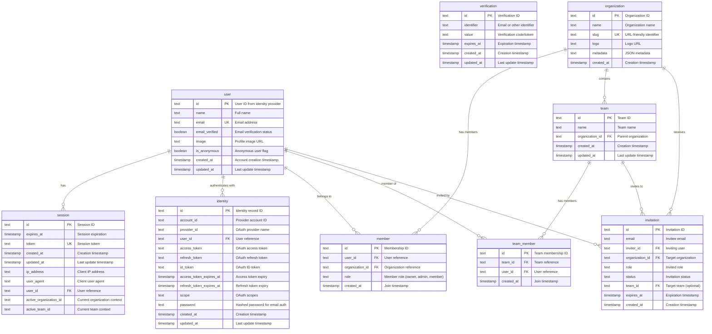

# Database Schema

This document describes the database schema for your application. The schema provides a foundation for building multi-tenant SaaS applications with authentication, organizations, teams, and role-based access control.

## Overview

The database uses:

- **Database Engine:** Neon PostgreSQL with Cloudflare Hyperdrive for edge optimization
- **ORM:** Drizzle ORM for type-safe database operations
- **Authentication:** Built on [Better Auth](https://www.better-auth.com/) specification
- **Connection Pooling:** Cloudflare Hyperdrive provides connection pooling and caching at the edge

The schema is divided into two main sections:

1. **Authentication tables** - Required for user authentication and session management
2. **Application tables** - For your specific business logic (organizations, teams, and your custom tables)

::: warning Important
The authentication tables follow [Better Auth's requirements](https://www.better-auth.com/docs/concepts/database). Maintain compatibility when extending these tables.
:::

## Entity Relationship Diagram



## Authentication Tables

These tables handle user authentication and are based on the Better Auth specification. They form the foundation of your application's security layer.

### Core Tables

#### `user` Table

Central table for all user accounts in your application.

| Column           | Type      | Description                           | Required |
| ---------------- | --------- | ------------------------------------- | -------- |
| `id`             | TEXT      | Primary key, typically a CUID or UUID | Yes      |
| `name`           | TEXT      | User's display name                   | Yes      |
| `email`          | TEXT      | Email address (unique)                | Yes      |
| `email_verified` | BOOLEAN   | Email verification status             | Yes      |
| `image`          | TEXT      | Profile image URL                     | No       |
| `is_anonymous`   | BOOLEAN   | Anonymous user flag                   | Yes      |
| `created_at`     | TIMESTAMP | Account creation time                 | Yes      |
| `updated_at`     | TIMESTAMP | Last modification time                | Yes      |

::: details TypeScript Schema Definition

```typescript
export const user = pgTable("user", {
  id: text().primaryKey(),
  name: text("name").notNull(),
  email: text("email").notNull().unique(),
  emailVerified: boolean("email_verified")
    .$defaultFn(() => false)
    .notNull(),
  image: text("image"),
  isAnonymous: boolean("is_anonymous")
    .$default(() => false)
    .notNull(),
  createdAt: timestamp("created_at", { withTimezone: true, mode: "date" })
    .defaultNow()
    .notNull(),
  updatedAt: timestamp("updated_at", { withTimezone: true, mode: "date" })
    .defaultNow()
    .$onUpdate(() => new Date())
    .notNull(),
});
```

:::

#### `session` Table

Manages active user sessions with device tracking and organization context.

| Column                   | Type      | Description             | Required |
| ------------------------ | --------- | ----------------------- | -------- |
| `id`                     | TEXT      | Session identifier      | Yes      |
| `expires_at`             | TIMESTAMP | Session expiration time | Yes      |
| `token`                  | TEXT      | Unique session token    | Yes      |
| `user_id`                | TEXT      | Reference to user       | Yes      |
| `ip_address`             | TEXT      | Client IP for security  | No       |
| `user_agent`             | TEXT      | Browser/client info     | No       |
| `active_organization_id` | TEXT      | Current org context     | No       |
| `active_team_id`         | TEXT      | Current team context    | No       |

#### `identity` Table

Handles authentication credentials for both OAuth providers and email/password.

::: info
This table is named `identity` in our schema but maps to Better Auth's `account` table.
:::

| Column                | Type           | Description                           | Required |
| --------------------- | -------------- | ------------------------------------- | -------- |
| `id`                  | TEXT           | Identity record ID                    | Yes      |
| `account_id`          | TEXT           | Provider-specific account ID          | Yes      |
| `provider_id`         | TEXT           | Provider name (google, email, etc.)   | Yes      |
| `user_id`             | TEXT           | Reference to user                     | Yes      |
| `password`            | TEXT           | Hashed password (email provider only) | No       |
| OAuth token fields... | TEXT/TIMESTAMP | Various OAuth tokens and expiries     | No       |

#### `verification` Table

Manages email verification, password resets, and other verification flows.

| Column       | Type      | Description                   | Required |
| ------------ | --------- | ----------------------------- | -------- |
| `id`         | TEXT      | Verification ID               | Yes      |
| `identifier` | TEXT      | Email or identifier to verify | Yes      |
| `value`      | TEXT      | Verification code/token       | Yes      |
| `expires_at` | TIMESTAMP | Code expiration               | Yes      |

## Application Tables

These tables implement the multi-tenant architecture with organizations and teams. They integrate with the authentication layer through Better Auth's [organization](https://www.better-auth.com/docs/plugins/organization) and [teams](https://www.better-auth.com/docs/plugins/teams) plugins.

### `organization` Table

Represents a tenant/company/workspace in your application. This is the primary grouping mechanism for multi-tenancy.

| Column     | Type | Description                      |
| ---------- | ---- | -------------------------------- |
| `id`       | TEXT | Organization ID                  |
| `name`     | TEXT | Display name                     |
| `slug`     | TEXT | URL-friendly identifier (unique) |
| `logo`     | TEXT | Logo image URL                   |
| `metadata` | TEXT | JSON for custom fields           |

### `member` Table

Defines the relationship between users and organizations, including their role within each organization.

| Column            | Type | Description                 |
| ----------------- | ---- | --------------------------- |
| `id`              | TEXT | Membership ID               |
| `user_id`         | TEXT | Reference to user           |
| `organization_id` | TEXT | Reference to organization   |
| `role`            | TEXT | Role (owner, admin, member) |

### `team` Table

Optional subgroups within organizations. Use teams when you need more granular permissions beyond organization-level roles.

| Column            | Type | Description         |
| ----------------- | ---- | ------------------- |
| `id`              | TEXT | Team ID             |
| `name`            | TEXT | Team name           |
| `organization_id` | TEXT | Parent organization |

### `invitation` Table

Tracks pending invitations. Users can be invited to join organizations with specific roles, and optionally assigned to teams.

| Column            | Type      | Description                |
| ----------------- | --------- | -------------------------- |
| `id`              | TEXT      | Invitation ID              |
| `email`           | TEXT      | Invitee's email            |
| `inviter_id`      | TEXT      | User who sent invitation   |
| `organization_id` | TEXT      | Target organization        |
| `role`            | TEXT      | Invited role               |
| `status`          | TEXT      | pending, accepted, expired |
| `team_id`         | TEXT      | Target team (optional)     |
| `expires_at`      | TIMESTAMP | Invitation expiry          |

## Extending the Schema

### Adding Your Own Tables

As you build your application, you'll add tables specific to your domain. Here's the recommended approach:

1. Create a new schema file in `db/schema/` for each logical group:

```typescript {7-12}
// db/schema/product.ts
export const product = pgTable("product", {
  id: text("id").primaryKey(),
  name: text("name").notNull(),
  description: text("description"),
  price: integer("price").notNull(), // Store in cents
  organizationId: text("organization_id")
    .notNull()
    .references(() => organization.id),
  createdBy: text("created_by")
    .notNull()
    .references(() => user.id),
  createdAt: timestamp("created_at", {
    withTimezone: true,
    mode: "date",
  }).defaultNow(),
});
```

2. Add relations for better querying:

```typescript
export const productRelations = relations(product, ({ one }) => ({
  organization: one(organization, {
    fields: [product.organizationId],
    references: [organization.id],
  }),
  creator: one(user, {
    fields: [product.createdBy],
    references: [user.id],
  }),
}));
```

3. Export from `db/schema/index.ts` and generate migrations

### Extending Existing Tables

To add fields to existing tables (like adding custom user fields):

1. Update the schema file:

```typescript
// db/schema/user.ts
export const user = pgTable("user", {
  // ... existing fields ...

  // Your custom fields
  phoneNumber: text("phone_number"),
  preferences: text("preferences"), // JSON string
  tier: text("tier").$default(() => "free"),
});
```

2. For authentication tables, update Better Auth configuration:

::: tip
When adding fields to authentication tables, always update the Better Auth configuration to ensure proper data handling.
:::

```typescript
betterAuth({
  user: {
    additionalFields: {
      phoneNumber: { type: "string", required: false },
      preferences: { type: "string", required: false },
      tier: { type: "string", required: false },
    },
  },
});
```

3. Generate and apply migrations:

```bash
bun --cwd db generate --name add-custom-fields
bun --cwd db migrate # or, bun --cwd db push
```

::: details Important: Schema Compatibility
When extending authentication tables, ensure your changes don't break Better Auth's expected schema. Always test authentication flows after making changes.
:::

### Role-Based Access Control

Implement RBAC using the member roles:

```typescript
// Check if user is organization admin
const membership = await db.query.member.findFirst({
  where: and(
    eq(member.userId, userId),
    eq(member.organizationId, orgId),
    eq(member.role, "admin"),
  ),
});

// Get all teams user belongs to
const teams = await db.query.teamMember.findMany({
  where: eq(teamMember.userId, userId),
  with: {
    team: true,
  },
});
```

## Common Query Patterns

### Multi-tenant Queries

Always scope queries to the current organization:

```typescript
// Get all products for the current organization
const products = await db.query.product.findMany({
  where: eq(product.organizationId, session.activeOrganizationId),
  with: {
    creator: {
      columns: { id: true, name: true, email: true },
    },
  },
});
```

### User Organization Access

Check user's access to resources:

```typescript
// Verify user has access to organization
const membership = await db.query.member.findFirst({
  where: and(eq(member.userId, userId), eq(member.organizationId, orgId)),
});

if (!membership) {
  throw new Error("Access denied");
}
```

### Complex Relationships

Load nested relationships efficiently:

```typescript
// Get organization with all members and their teams
const org = await db.query.organization.findFirst({
  where: eq(organization.id, orgId),
  with: {
    members: {
      with: {
        user: true,
      },
    },
    teams: {
      with: {
        members: {
          with: {
            user: true,
          },
        },
      },
    },
  },
});
```

## Best Practices

### Security Considerations

::: danger Security Critical

- **Never expose sensitive tokens**: Access tokens, refresh tokens, and passwords should never be sent to the client
- **Validate organization context**: Always verify user has access to the organization they're trying to access
- **Use parameterized queries**: Drizzle ORM handles this automatically
- **Implement rate limiting**: Especially for invitation endpoints
  :::

### Performance Tips

::: tip Optimization Guidelines

- **Index frequently queried fields**: Email, slug, and foreign keys are already indexed in PostgreSQL
- **Use relations for complex queries**: Drizzle's `with` clause is more efficient than multiple queries
- **Batch operations when possible**: Use `db.insert().values([...])` for bulk inserts
- **Limit data fetching**: Only select columns you need using the `columns` option
- **Leverage Hyperdrive**: Connection pooling and caching reduce latency at the edge
  :::

### Design Patterns

#### Multi-tenant Data Isolation

Every table that contains user data should reference an organization:

```typescript {4-6}
// Always include organizationId in your tables
export const yourTable = pgTable("your_table", {
  id: text("id").primaryKey(),
  organizationId: text("organization_id")
    .notNull()
    .references(() => organization.id),
  // ... other fields
});

// Always filter by organization in queries
where: eq(yourTable.organizationId, currentOrgId);
```

#### Soft Deletes

Preserve data integrity by marking records as deleted:

```typescript
// Add to your schema
deletedAt: timestamp("deleted_at", { withTimezone: true, mode: "date" }),

// Filter out deleted records
where: isNull(table.deletedAt),

// Soft delete
await db
  .update(yourTable)
  .set({ deletedAt: new Date() })
  .where(eq(yourTable.id, recordId));
```

#### Audit Fields

Track who created/updated records:

```typescript
createdBy: text("created_by").references(() => user.id),
updatedBy: text("updated_by").references(() => user.id),
createdAt: timestamp("created_at", { withTimezone: true, mode: "date" }).defaultNow(),
updatedAt: timestamp("updated_at", { withTimezone: true, mode: "date" }).defaultNow().$onUpdate(() => new Date()),
```

## Next Steps

1. Add your domain-specific tables in `db/schema/`
2. Configure authentication providers in `api/lib/auth.ts`
3. Set up database backups for production deployments
4. Implement proper access control in your API endpoints

## Additional Resources

- [Better Auth Documentation](https://www.better-auth.com/docs) - Authentication flows and plugins
- [Drizzle ORM Documentation](https://orm.drizzle.team/) - Database queries and migrations
- [Neon PostgreSQL Documentation](https://neon.tech/docs) - Database deployment and optimization
- [Cloudflare Hyperdrive Documentation](https://developers.cloudflare.com/hyperdrive/) - Connection pooling and edge optimization
