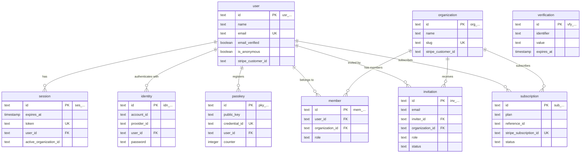

# Schema

The database schema lives in `db/schema/`, with one file per entity group. Drizzle ORM's `casing: "snake_case"` option maps camelCase TypeScript properties to snake_case database columns automatically.

## Conventions

**Primary keys** – All tables use application-generated prefixed CUID2 IDs (e.g., `usr_ght4k2jxm7pqbv01`). The 3-character prefix encodes the entity type for recognition in logs, URLs, and support tickets.

| Model        | Prefix | Table          |
| ------------ | ------ | -------------- |
| user         | `usr`  | `user`         |
| session      | `ses`  | `session`      |
| account      | `idn`  | `identity`     |
| verification | `vfy`  | `verification` |
| organization | `org`  | `organization` |
| member       | `mem`  | `member`       |
| invitation   | `inv`  | `invitation`   |
| passkey      | `pky`  | `passkey`      |
| subscription | `sub`  | `subscription` |

IDs are generated at the application level via `$defaultFn()` – no database sequences or UUID functions. See `db/schema/id.ts` for the implementation and [Prefixed CUID2 IDs](/specs/prefixed-ids) for design rationale.

**Timestamps** – Every table has `createdAt` and `updatedAt` columns using `timestamp({ withTimezone: true, mode: "date" })`. `createdAt` defaults to `now()`; `updatedAt` auto-updates via `$onUpdate(() => new Date())`.

**Foreign keys** – All FKs use `onDelete: "cascade"`. Every FK column gets a btree index named `{table}_{column}_idx`.

**No enums** – `member.role` and `invitation.status` are plain `text` columns, not `pgEnum`. This avoids fragile coupling with Better Auth's role values.

## Entity Relationship Diagram



## Table Groups

### Authentication Tables

Managed by [Better Auth](https://www.better-auth.com/docs/concepts/database). Extend with care – changes must stay compatible with the auth framework.

| Table          | File                | Purpose                                                                                                       |
| -------------- | ------------------- | ------------------------------------------------------------------------------------------------------------- |
| `user`         | `schema/user.ts`    | User accounts – name, email, verification status, Stripe customer ID                                          |
| `session`      | `schema/user.ts`    | Active sessions with device tracking and [active organization context](/auth/sessions)                        |
| `identity`     | `schema/user.ts`    | OAuth credentials and email/password (Better Auth's `account` table, [renamed](/auth/#identity-table-rename)) |
| `verification` | `schema/user.ts`    | OTP codes, email verification tokens                                                                          |
| `passkey`      | `schema/passkey.ts` | WebAuthn credentials for [passwordless auth](/auth/passkeys)                                                  |

::: warning
Authentication tables follow [Better Auth's schema requirements](https://www.better-auth.com/docs/concepts/database). When adding columns, register them in the auth config's `additionalFields` to ensure proper data handling.
:::

::: details user table – TypeScript definition

```ts
// db/schema/user.ts
export const user = pgTable("user", {
  id: text()
    .primaryKey()
    .$defaultFn(() => generateAuthId("user")),
  name: text().notNull(),
  email: text().notNull().unique(),
  emailVerified: boolean().default(false).notNull(),
  image: text(),
  isAnonymous: boolean().default(false).notNull(),
  stripeCustomerId: text(),
  createdAt: timestamp({ withTimezone: true, mode: "date" })
    .defaultNow()
    .notNull(),
  updatedAt: timestamp({ withTimezone: true, mode: "date" })
    .defaultNow()
    .$onUpdate(() => new Date())
    .notNull(),
});
```

:::

### Organization Tables

Multi-tenancy via Better Auth's [organization plugin](https://www.better-auth.com/docs/plugins/organization).

| Table          | File                     | Purpose                                                          |
| -------------- | ------------------------ | ---------------------------------------------------------------- |
| `organization` | `schema/organization.ts` | Tenants / workspaces – name, slug, logo, metadata                |
| `member`       | `schema/organization.ts` | User ↔ organization membership with roles (owner, admin, member) |
| `invitation`   | `schema/invitation.ts`   | Pending org invitations with status lifecycle                    |

Key constraints:

- `member(userId, organizationId)` is unique – one membership per user per org
- `invitation(organizationId, email)` is unique – one pending invite per email per org
- `session.activeOrganizationId` has an index but no FK constraint (Better Auth design)
- `organization.metadata` is `text`, not JSONB – Better Auth serializes it as a string

### Billing Tables

Managed by the [`@better-auth/stripe`](https://www.better-auth.com/docs/plugins/stripe) plugin. Do not insert or update records manually – the plugin handles the subscription lifecycle via Stripe webhooks.

| Table          | File                     | Purpose                                         |
| -------------- | ------------------------ | ----------------------------------------------- |
| `subscription` | `schema/subscription.ts` | Stripe subscription state, plan, billing period |

The `referenceId` column is polymorphic: it points to `user.id` for personal billing or `organization.id` for org-level billing.

## Extended Fields

Several tables include columns beyond Better Auth's defaults:

- **passkey:** `lastUsedAt` (security audits), `deviceName` (user-friendly label like "MacBook Pro"), `platform` ("platform" or "cross-platform")
- **invitation:** `acceptedAt` / `rejectedAt` lifecycle timestamps

## Adding a New Table

**1. Create a schema file** in `db/schema/`:

```ts
// db/schema/product.ts
import { pgTable, text, integer, timestamp } from "drizzle-orm/pg-core";
import { relations } from "drizzle-orm";
import { generateId } from "./id";
import { organization } from "./organization";
import { user } from "./user";

export const product = pgTable("product", {
  id: text()
    .primaryKey()
    .$defaultFn(() => generateId("prd")),
  name: text().notNull(),
  description: text(),
  price: integer().notNull(),
  organizationId: text()
    .notNull()
    .references(() => organization.id, { onDelete: "cascade" }),
  createdBy: text()
    .notNull()
    .references(() => user.id),
  createdAt: timestamp({ withTimezone: true, mode: "date" })
    .defaultNow()
    .notNull(),
  updatedAt: timestamp({ withTimezone: true, mode: "date" })
    .defaultNow()
    .$onUpdate(() => new Date())
    .notNull(),
});

export const productRelations = relations(product, ({ one }) => ({
  organization: one(organization, {
    fields: [product.organizationId],
    references: [organization.id],
  }),
  creator: one(user, {
    fields: [product.createdBy],
    references: [user.id],
  }),
}));
```

**2. Export from the barrel file:**

```ts
// db/schema/index.ts
export * from "./product"; // [!code ++]
```

**3. Generate and apply the migration:**

```bash
bun db:generate
bun db:migrate
```

See [Migrations](./migrations) for the full workflow.

## Extending Auth Tables

To add custom columns to authentication tables, update both the Drizzle schema and the Better Auth config:

```ts
// db/schema/user.ts – add the column
export const user = pgTable("user", {
  // ... existing fields ...
  phoneNumber: text(), // [!code ++]
});
```

```ts
// apps/api/lib/auth.ts – register with Better Auth
betterAuth({
  user: {
    additionalFields: {
      phoneNumber: { type: "string", required: false }, // [!code ++]
    },
  },
});
```

Then [generate and apply migrations](./migrations) as usual.
